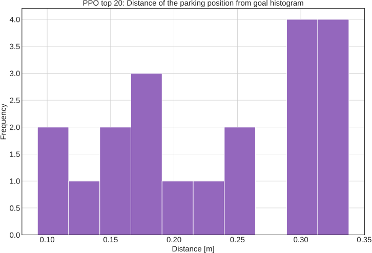
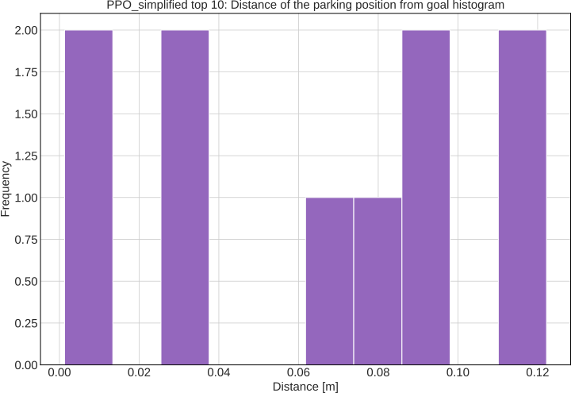
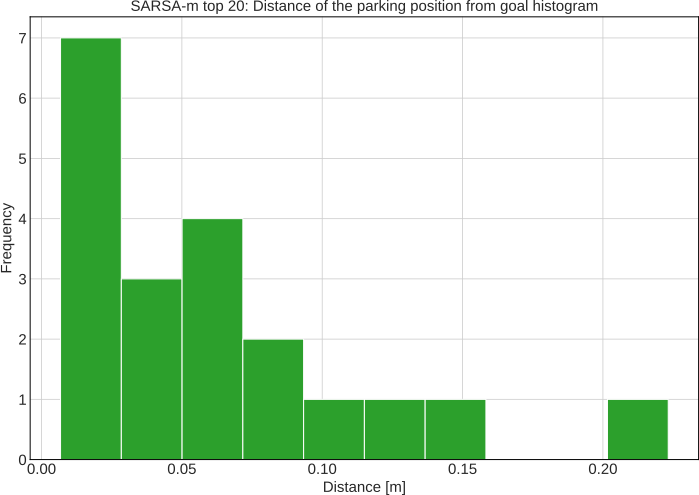
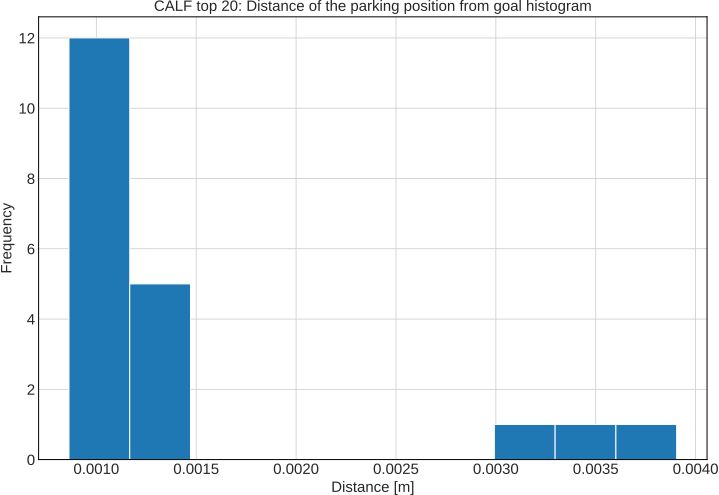

>**About**

This repository contains the codes for our CALF paper empowered by the [Regelum](https://github.com/osinenkop/regelum-control) framework. The main purpose is to validate CALF performance and it's relative SARSA-m over well-known controllers namely PPO, MPC, and Nominal controller.

For more details, please refer to the paper.

> **Table of Contents**
- [Method Overview](#method-overview)
- [Getting Started](#getting-started)
- [Experimental achievement](#experimental-achievement)
- [Plots](#plots)
- [Analysis](#analysis)
- [Remark](#remark)
- [Licence](#licence)
  - [Bibtex reference](#bibtex-reference)

# Method Overview


# Getting Started

All the reproduction steps can be found [here](docs/get_started.md).

# Experimental achievement

At the end of this experiment, the turtlebot is capaple of reaching the goal without passing the "hot" spot.

[](https://www.youtube.com/watch?v=RgiDHzE5-w8)


# Plots

## PPO

PPO has unstable performances. Despite some runs successfully parking nearby the target, the rest keeps a certain distance away from the goal area.

  

   

## SARSA-m


  

 

## CALF

 

 

# Analysis

# Remark

The behavior of all controllers in reaching the goal was entirely driven by the learning process, without relying on traditional path planning methods such as cell decomposition or potential fields.

# Licence

This project is licensed under the terms of the [MIT license](https://github.com/osinenkop/regelum-control/blob/main/LICENSE).

## Bibtex reference

Thank you for citing [Regelum control](https://github.com/osinenkop/regelum-control) if you use any of this code.

```
@misc{regelum2024,
author =   {Pavel Osinenko, Grigory Yaremenko, Georgiy Malaniya, Anton Bolychev},
title =    {Regelum: a framework for simulation, control and reinforcement learning},
howpublished = {\url{https://github.com/osinekop/regelum-control}},
year = {2024},
note = {Licensed under the MIT License}
}
```
