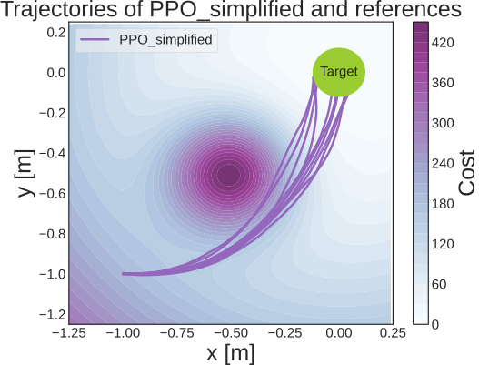

>**About**

This repository contains the codes for our CALF paper empowered by the [Regelum](https://github.com/osinenkop/regelum-control) framework. The main purpose is to validate CALF performance and it's relative SARSA-m over well-known controllers namely PPO, MPC, and Nominal controller.

For more details, please refer to the paper.

> **Table of Contents**
- [Method Overview](#method-overview)
- [Getting Started](#getting-started)
- [Experimental achievement](#experimental-achievement)
- [Plots](#plots)
  - [PPO](#ppo)
  - [SARSA-m](#sarsar-m)
  - [CALF](#calf)
  - [Parking position error](#parking-position-error)

- [Analysis](#analysis)
- [Remark](#remark)
- [Licence](#licence)
  - [Bibtex reference](#bibtex-reference)

# Method Overview

<div align="center">

</div>

# Getting Started

All the setting up and reproduction steps can be found [here](docs/get_started.md).

# Experimental achievement

At the end of this [experiment](https://www.youtube.com/watch?v=RgiDHzE5-w8&ab_channel=RomanZashchitin), the turtlebot is capaple of reaching the goal without passing the "hot" spot.

<div align="center">

</div>

# Plots

## PPO

PPO has unstable performances. Despite some runs successfully parking nearby the target, the rest keeps a certain distance away from the goal area.

On the left side, `PPO_full` trajectories are raw trajectories from PPO derived mentioned behaviors.

On the right side, supposing that all the robot stops when reaching the area around the target x=0, y=0 a radius of 0.12 meter, `PPO_simplified` depicts top 10 trajectories satisfying that parking condition.

<div align="center">
 
</div>

## SARSA-m

These 2 figures show unpredictable runs of SARSA-m with top 20 and top 10 runs having lowest accumulated cost. To see how many runs can reach the goal, please have a look at [this histogram](#parking-position-error).

<div align="center">
 
</div>

## CALF

Robot always targets the goal with CALF controllers. These 2 figure are top 20 and top 10 runs having lowest accumulated cost.

<div align="center">
 
</div>

## Parking position error

Here is the comparison of the successfully parking frequency of proposed controllers. Overall, CALF is totally successfull in parking at the goal, and 17 of 20 runs of SARSA-m could reach the goal while PPO needs a condition of stopping at the target area to meet the goal.

<div align="center">
 
</div>

# Analysis

A simple notebook was written for controllers performance monitoring and analysis.

Due to the storing stucture of regelum, datetime format to pick up a checkpoint is utilized as below.

To load single checkpoint:
```
start_datetime_str = end_datetime_str = "2024-08-29 16-29-17"
```


To load multi-checkpoints:

```
start_datetime_str = "2024-08-29 16-29-17"
end_datetime_str = "2024-08-30 06-07-04"
```

All possible checkpoints could be found by using [MLFlow](docs/installation.md#monitor-training-progress-and-pick-checkpoints).

The above loading mechanism is used in this [Jupyter Notebook](notebooks/simple_plotting.ipynb) where show trajectories, learning curves, accumulated cost over time, and control signals.

NOTE: `regelum-control` should be installed in a jupyter kernel server.

# Remark

We consider the task of mobile robot parking as a benchmarking playground for the studied agents. In general, RL agents apply to any dynamical systems, not restricted to settings addressable by traditional path planning. The mobile robot studied poses a canonical example of a non-holonomic control system hence the interest in it specifically herein. Interested reader may refer to tabular RL though. Yet, curse of dimensionality may pose a formidable problem there.

The behavior of all controllers in reaching the goal was entirely driven by the learning process, without relying on traditional path planning methods such as cell decomposition or potential fields.

# Licence

This project is licensed under the terms of the [MIT license](https://github.com/osinenkop/regelum-control/blob/main/LICENSE).


## Reference
Our experiment is based on Regelum with following credit.
```
@misc{regelum2024,
author =   {Pavel Osinenko, Grigory Yaremenko, Georgiy Malaniya, Anton Bolychev},
title =    {Regelum: a framework for simulation, control and reinforcement learning},
howpublished = {\url{https://github.com/osinekop/regelum-control}},
year = {2024},
note = {Licensed under the MIT License}
}
```

## Bibtex cite

If you use our code for you projects please give us a credit:
and here the bibtex entry for our repo

```
@misc{calfrobot2024,
author =   {Grigory Yaremenko, Dmitrii Dobriborsci, Roman Zashchitin, Ruben Contreras Maestre, Ngoc Quoc Huy Hoang, Pavel Osinenko},
title =    {A novel agent with formal goal-reaching guarantees: an experimental study with a mobile robot},
howpublished = {\url{https://github.com/thd-research/calf-rl-mobile-robot}},
year = {2024},
note = {Licensed under the MIT License}
}
```
